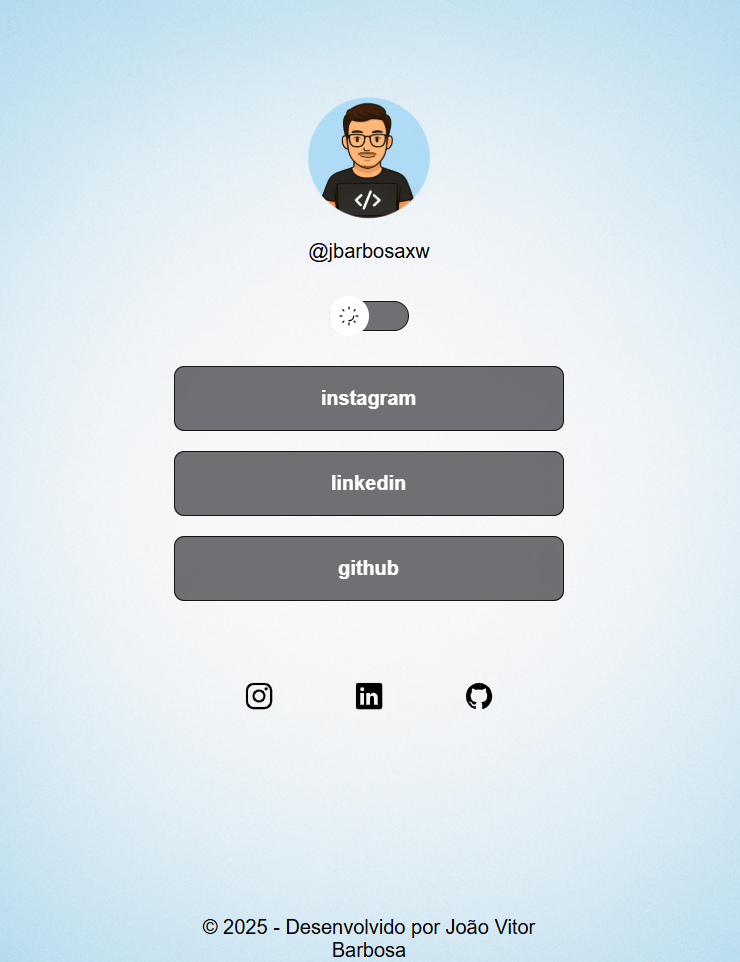
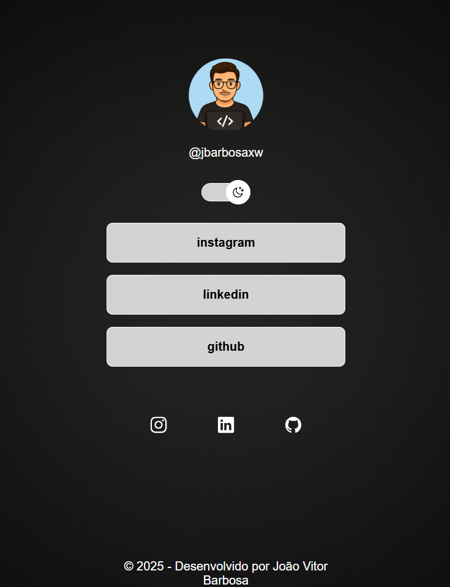

# Linktree Personalizado

Linktree Personalizado

  Projeto desenvolvido para reunir e centralizar os principais links de contato e redes sociais em uma única página.  
  Conta com <strong>modo claro/escuro</strong>, design minimalista e responsivo.

  <a href="#-tecnologias">Tecnologias</a>&nbsp;&nbsp;&nbsp;|&nbsp;&nbsp;&nbsp;
  <a href="#-projeto">Projeto</a>&nbsp;&nbsp;&nbsp;|&nbsp;&nbsp;&nbsp;
  <a href="#-layout">Layout</a>&nbsp;&nbsp;&nbsp;|&nbsp;&nbsp;&nbsp;
  <a href="#memo-licença">Licença</a>

  

 

## 🚀 Tecnologias

Esse projeto foi desenvolvido com as seguintes tecnologias:

- **HTML5** 📄  
- **CSS3** 🎨  
- **JavaScript** ⚡  

---

## 💻 Projeto

O objetivo do projeto é oferecer uma alternativa personalizada ao Linktree, permitindo que qualquer pessoa possa compartilhar seus principais links de contato em um único lugar.  
Ele é totalmente responsivo, com suporte a **tema claro e escuro**.

---

## 🔖 Layout

### 🌞 Modo Claro  

### 🌙 Modo Escuro  

---

## :memo: Licença

Esse projeto está sob a licença MIT.  
Feito com 💜 por **João Vitor Barbosa** 🚀

- Instagram: [@jbarbosaxw](https://instagram.com/jbarbosaxw)  
- LinkedIn: [Perfil](https://linkedin.com/in/jbarbosaxw)  
- GitHub: [Repositório](https://github.com/jbarbosaxw
